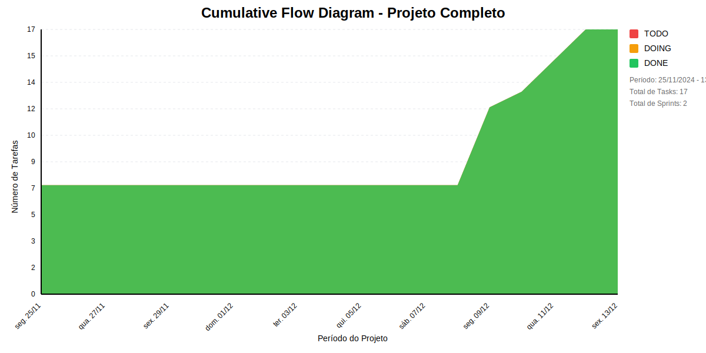

# 📊 Visão Geral do Projeto 

Dashboard de BI do Conecta Fapes
* Data de Início: 01/12/2024
* Data de Planejado: 28/02/2025
* Data de Finalização: 

Dashboard de BI do Conecta Fapes
## Métricas Consolidadas

| Sprint | Período | Duração | Total Tasks | Concluídas | Em Progresso | Pendentes | Velocidade | Eficiência |
|--------|---------|----------|-------------|------------|--------------|-----------|------------|------------|
| Entender os objetivos organizacionais | 24/11 - 05/12 | 11 dias | 7 | 4 (57.1%) | 3 | 0 | 0.36/dia | 57.1% |
| Levantar Infraestrutura de BI no LEDS | 08/12 - 12/12 | 4 dias | 10 | 0 (0.0%) | 10 | 0 | 0/dia | 0.0% |

## Análise Geral

- **Total de Sprints:** 2
- **Total de Tasks:** 17
- **Taxa de Conclusão:** 23.5%

### Notas
- Período Total: 24/11 - 12/12
- Média de Duração das Sprints: 8 dias

*Última atualização: dezembro de 2024*

## Cumulative Flow 

 ## Previsão do Projeto 

## 🎯 Conclusão Principal

### ❌ ALTO RISCO DE ATRASO NO PROJETO

- **Probabilidade de conclusão no prazo**: 18.1%
- **Data mais provável de conclusão**: qui., 19/12/2024
- **Dias em relação ao planejado**: 7 dias
- **Status**: ⚠️ Atraso Moderado

### 📊 Métricas do Projeto

| Métrica | Valor | Status |
|---------|--------|--------|
| Velocidade Atual | 2.0 tarefas/dia | ❌ |
| Velocidade Necessária | 6.5 tarefas/dia | - |
| Dias Restantes | 2 dias | - |
| Tarefas Restantes | 13 tarefas | - |

### 📅 Previsões de Data de Conclusão

| Data | Probabilidade | Status | Observação |
|------|---------------|---------|------------|
| ter., 17/12/2024 | 18.1% | ⚠️ Pequeno Atraso |  |
| qua., 18/12/2024 | 16.1% | ⚠️ Atraso Moderado |  |
| qui., 19/12/2024 | 42.5% | ⚠️ Atraso Moderado | 📍 Data mais provável |
| sex., 20/12/2024 | 8.1% | ⚠️ Atraso Moderado |  |
| seg., 23/12/2024 | 13.0% | ⚠️ Atraso Moderado |  |
| ter., 24/12/2024 | 1.0% | ⚠️ Atraso Moderado |  |
| qua., 25/12/2024 | 1.1% | ⚠️ Atraso Moderado |  |
| qui., 26/12/2024 | 0.1% | ⚠️ Atraso Moderado |  |
| sex., 27/12/2024 | 0.0% | ⚠️ Atraso Moderado |  |

## 💡 Recomendações

1. ❌ Realizar reunião de emergência
2. ❌ Reavaliar escopo do projeto
3. ❌ Considerar adição de recursos ou redução de escopo

## ℹ️ Informações do Projeto

- **Total de Sprints**: 2
- **Início**: seg., 25/11/2024
- **Término Planejado**: sex., 13/12/2024
- **Total de Tarefas**: 17
- **Simulações Realizadas**: 10,000

---
*Relatório gerado em 11/12/2024, 10:17:49*