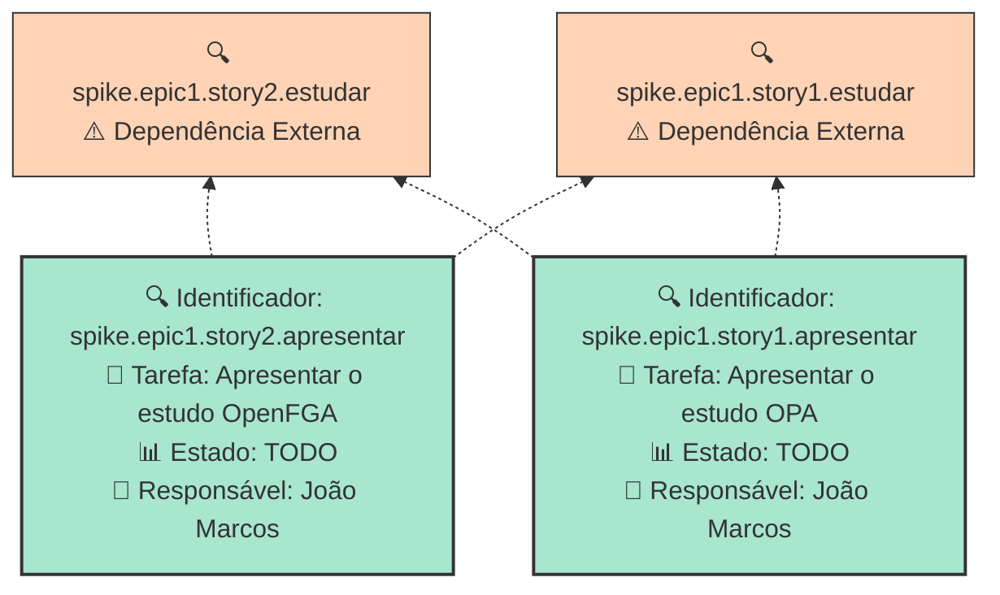
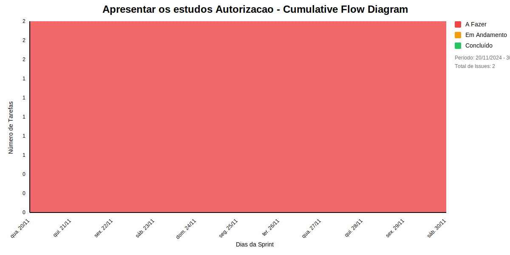

        
        # APRESENTAR OS ESTUDOS AUTORIZACAO
        Apresentar estudos sobre OPA e openFGA

        ## Dados do Sprint
        * **Goal**:  Apresentar estudos sobre OPA e openFGA
        * **Data Início**: 20/11/2024
        * **Data Fim**: 30/11/2024
        * **Status**: PLANNED
        ## Sprint Backlog

        |ID |Nome |Resposável |Data de Inicío | Data Planejada | Status|
        |:----    |:----|:--------  |:-------:       | :----------:  | :---: |
        |spike.epic1.story2.apresentar|Apresentar o estudo OpenFGA|João Marcos ||30/11/2024|TODO|
|spike.epic1.story1.apresentar|Apresentar o estudo OPA|João Marcos ||30/11/2024|TODO|
      
        # Análise de Dependências do Sprint

Análise gerada em: 04/12/2024, 15:06:49

## 🔍 Grafo de Dependências

**Legenda:**
- 🟢 Verde Claro: Issues no sprint
- 🟢 Verde Escuro: Issues concluídas
- 🟡 Laranja: Dependências externas ao sprint
- ➡️ Linha sólida: Dependência no sprint
- ➡️ Linha pontilhada: Dependência externa

## 📋 Sugestão de Execução das Issues

| # | Issue | Título | Status | Responsável | Dependências |
|---|-------|--------|--------|-------------|---------------|
| 1 | spike.epic1.story2.apresentar | Apresentar o estudo OpenFGA | TODO | João Marcos  | spike.epic1.story2.estudar⚠️, spike.epic1.story1.estudar⚠️ |
| 2 | spike.epic1.story1.apresentar | Apresentar o estudo OPA | TODO | João Marcos  | spike.epic1.story2.estudar⚠️, spike.epic1.story1.estudar⚠️ |

**Legenda das Dependências:**
- 🆓 Sem dependências
- ✅ Issue concluída
- ⚠️ Dependência externa ao sprint

        
       
        ## Cumulative Flow
        
        
        
        