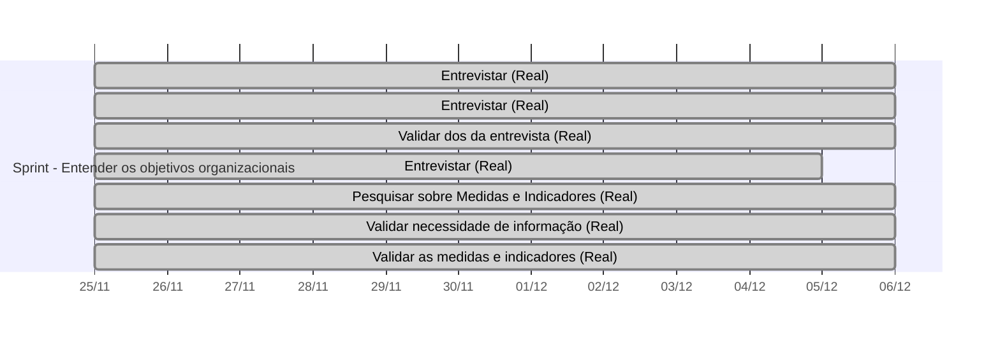
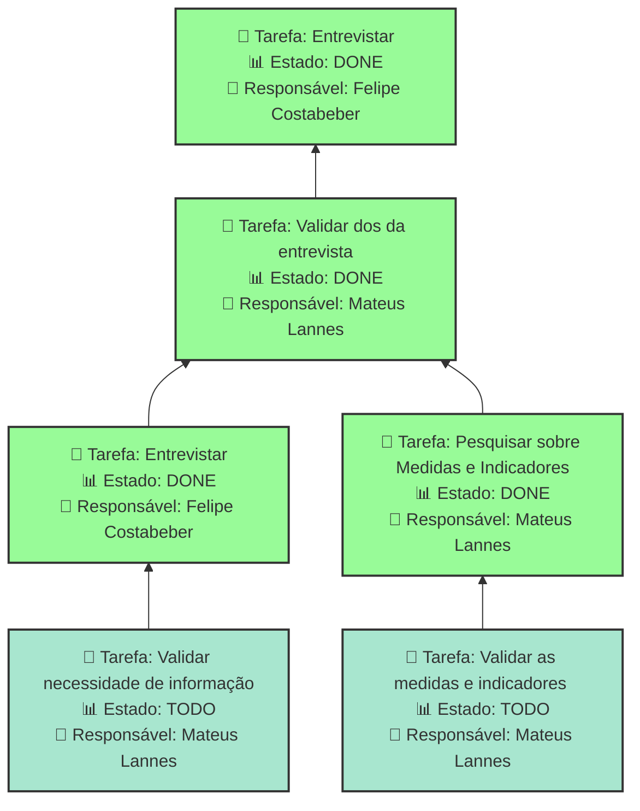
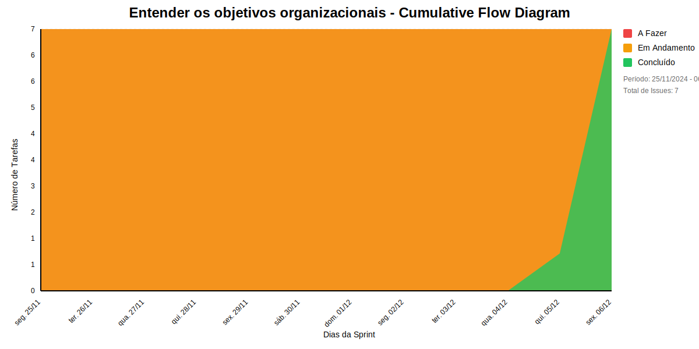
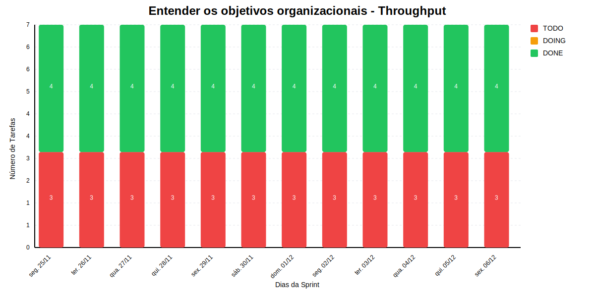

# ENTENDER OS OBJETIVOS ORGANIZACIONAIS

Entender os objetivos organizacionais da FAPES

## Dados do Sprint
* **Goal**:  Entender os objetivos organizacionais da FAPES
* **Data Início**: 25/11/2024
* **Data Fim**: 06/12/2024
* **Status**: CLOSED
## Sprint Backlog

|Nome |Descrição|Resposável |Data de Inicio Planejada| Data de Entrega Planejada| Data de Inicío | Data Entrega | Status|
|:----|:---------|:-------- |:----------------------:| :-----------------------:| :------------: |:------------:|:-----:|
|Entrevistar|Entrevista os clientes para levantar os objetivos organizacionais relacionados bolsa|Mateus Lannes |25/11/2024|25/11/2024|25/11/2024|06/12/2024|TODO|
|Entrevistar|Entrevista os clientes para levantar os objetivos organizacionais relacionados bolsa|Felipe Costabeber|25/11/2024|25/11/2024|25/11/2024|06/12/2024|DONE|
|Validar dos da entrevista|Validar objetivos organizacionais|Mateus Lannes |25/11/2024|25/11/2024|25/11/2024|06/12/2024|DONE|
|Entrevistar|Entrevista os clientes para levantar os objetivos organizacionais relacionados bolsa|Felipe Costabeber|25/11/2024|25/11/2024|25/11/2024|05/12/2024|DONE|
|Pesquisar sobre Medidas e Indicadores|Pesquisar sobre medidas e indicadores para atender a necessidade de informações|Mateus Lannes |25/11/2024|25/11/2024|25/11/2024|06/12/2024|DONE|
|Validar necessidade de informação|Validar as necessidade de informação|Mateus Lannes |25/11/2024|25/11/2024|25/11/2024|06/12/2024|TODO|
|Validar as medidas e indicadores |Validar medias e indicadores|Mateus Lannes |25/11/2024|25/11/2024|25/11/2024|06/12/2024|TODO|
     
## Gantt 

# Análise de Dependências do Sprint

Análise gerada em: 14/12/2024, 16:59:52

## 🔍 Grafo de Dependências

**Legenda:**
- 🟢 Verde Claro: Issues no sprint
- 🟢 Verde Escuro: Issues concluídas
- 🟡 Laranja: Dependências externas ao sprint
- ➡️ Linha sólida: Dependência no sprint
- ➡️ Linha pontilhada: Dependência externa

## 📋 Sugestão de Execução das Issues

| # | Título | Status | Responsável | Dependências |
|---|--------|--------|-------------|---------------|
| 1 | Entrevistar | DONE | Felipe Costabeber | 🆓 |
| 2 | Validar necessidade de informação | TODO | Mateus Lannes  | Entrevistar✅ |
| 3 | Validar as medidas e indicadores  | TODO | Mateus Lannes  | Pesquisar sobre Medidas e Indicadores✅ |
| 4 | Entrevistar | DONE | Felipe Costabeber | Validar dos da entrevista✅ |
| 5 | Pesquisar sobre Medidas e Indicadores | DONE | Mateus Lannes  | Validar dos da entrevista✅ |
| 6 | Validar dos da entrevista | DONE | Mateus Lannes  | Entrevistar✅ |

**Legenda das Dependências:**
- 🆓 Sem dependências
- ✅ Issue concluída
- ⚠️ Dependência externa ao sprint

            
## Cumulative Flow

## Throughput

        

        