        
        # ENTENDER OS OBJETIVOS ORGANIZACIONAIS
        Entender os objetivos organizacionais da FAPES

        ## Dados do Sprint
        * **Goal**:  Entender os objetivos organizacionais da FAPES
        * **Data Início**: 25/11/2024
        * **Data Fim**: 06/12/2024
        * **Status**: CLOSED
        ## Sprint Backlog

        |ID |Nome |Resposável |Data de Inicío | Data Planejada | Status|
        |:----    |:----|:--------  |:-------:       | :----------:  | :---: |
        |bi.identificarobjetivo.identificarobjetivos.entrevista|Entrevistar|Mateus Lannes |25/11/2024|06/12/2024|TODO|
|bi.identificarobjetivo.identificarobjetivos.entrevista|Entrevistar|Felipe Costabeber|25/11/2024|06/12/2024|DONE|
|bi.identificarobjetivo.identificarobjetivos.validar|Validar dos da entrevista|Mateus Lannes |25/11/2024|06/12/2024|DONE|
|bi.identificarobjetivo.identificarnecessidadeinformacao.entrevista|Entrevistar|Felipe Costabeber|25/11/2024|05/12/2024|DONE|
|bi.identificarobjetivo.definirmedidasindicadores.pesquisar|Pesquisar sobre Medidas e Indicadores|Mateus Lannes |25/11/2024|06/12/2024|DONE|
|bi.identificarobjetivo.identificarnecessidadeinformacao.validar|Validar necessidade de informação|Mateus Lannes |25/11/2024|06/12/2024|TODO|
|bi.identificarobjetivo.definirmedidasindicadores.validar|Validar as medidas e indicadores |Mateus Lannes |25/11/2024|06/12/2024|TODO|
      
        # Análise de Dependências do Sprint

Análise gerada em: 10/12/2024, 14:09:35

## 🔍 Grafo de Dependências

```mermaid
graph BT
    classDef sprint fill:#a8e6cf,stroke:#333,stroke-width:2px;
    classDef done fill:#98fb98,stroke:#333,stroke-width:2px;
    classDef external fill:#ffd3b6,stroke:#333,stroke-width:1px;
    bi.identificarobjetivo.identificarobjetivos.entrevista["🔍 Identificador: bi.identificarobjetivo.identificarobjetivos.entrevista<br>📝 Tarefa: Entrevistar<br>📊 Estado: DONE<br>👤 Responsável: Felipe Costabeber"]:::done
    bi.identificarobjetivo.identificarnecessidadeinformacao.validar["🔍 Identificador: bi.identificarobjetivo.identificarnecessidadeinformacao.validar<br>📝 Tarefa: Validar necessidade de informação<br>📊 Estado: TODO<br>👤 Responsável: Mateus Lannes "]:::sprint
    bi.identificarobjetivo.definirmedidasindicadores.validar["🔍 Identificador: bi.identificarobjetivo.definirmedidasindicadores.validar<br>📝 Tarefa: Validar as medidas e indicadores <br>📊 Estado: TODO<br>👤 Responsável: Mateus Lannes "]:::sprint
    bi.identificarobjetivo.identificarnecessidadeinformacao.entrevista["🔍 Identificador: bi.identificarobjetivo.identificarnecessidadeinformacao.entrevista<br>📝 Tarefa: Entrevistar<br>📊 Estado: DONE<br>👤 Responsável: Felipe Costabeber"]:::done
    bi.identificarobjetivo.definirmedidasindicadores.pesquisar["🔍 Identificador: bi.identificarobjetivo.definirmedidasindicadores.pesquisar<br>📝 Tarefa: Pesquisar sobre Medidas e Indicadores<br>📊 Estado: DONE<br>👤 Responsável: Mateus Lannes "]:::done
    bi.identificarobjetivo.identificarobjetivos.validar["🔍 Identificador: bi.identificarobjetivo.identificarobjetivos.validar<br>📝 Tarefa: Validar dos da entrevista<br>📊 Estado: DONE<br>👤 Responsável: Mateus Lannes "]:::done
    bi.identificarobjetivo.identificarobjetivos.validar --> bi.identificarobjetivo.identificarobjetivos.entrevista
    bi.identificarobjetivo.identificarnecessidadeinformacao.entrevista --> bi.identificarobjetivo.identificarobjetivos.validar
    bi.identificarobjetivo.definirmedidasindicadores.pesquisar --> bi.identificarobjetivo.identificarobjetivos.validar
    bi.identificarobjetivo.identificarnecessidadeinformacao.validar --> bi.identificarobjetivo.identificarnecessidadeinformacao.entrevista
    bi.identificarobjetivo.definirmedidasindicadores.validar --> bi.identificarobjetivo.definirmedidasindicadores.pesquisar
```

**Legenda:**
- 🟢 Verde Claro: Issues no sprint
- 🟢 Verde Escuro: Issues concluídas
- 🟡 Laranja: Dependências externas ao sprint
- ➡️ Linha sólida: Dependência no sprint
- ➡️ Linha pontilhada: Dependência externa

## 📋 Sugestão de Execução das Issues

| # | Issue | Título | Status | Responsável | Dependências |
|---|-------|--------|--------|-------------|---------------|
| 1 | bi.identificarobjetivo.identificarobjetivos.entrevista | Entrevistar | DONE | Felipe Costabeber | 🆓 |
| 2 | bi.identificarobjetivo.identificarnecessidadeinformacao.validar | Validar necessidade de informação | TODO | Mateus Lannes  | bi.identificarobjetivo.identificarnecessidadeinformacao.entrevista✅ |
| 3 | bi.identificarobjetivo.definirmedidasindicadores.validar | Validar as medidas e indicadores  | TODO | Mateus Lannes  | bi.identificarobjetivo.definirmedidasindicadores.pesquisar✅ |
| 4 | bi.identificarobjetivo.identificarnecessidadeinformacao.entrevista | Entrevistar | DONE | Felipe Costabeber | bi.identificarobjetivo.identificarobjetivos.validar✅ |
| 5 | bi.identificarobjetivo.definirmedidasindicadores.pesquisar | Pesquisar sobre Medidas e Indicadores | DONE | Mateus Lannes  | bi.identificarobjetivo.identificarobjetivos.validar✅ |
| 6 | bi.identificarobjetivo.identificarobjetivos.validar | Validar dos da entrevista | DONE | Mateus Lannes  | bi.identificarobjetivo.identificarobjetivos.entrevista✅ |

**Legenda das Dependências:**
- 🆓 Sem dependências
- ✅ Issue concluída
- ⚠️ Dependência externa ao sprint

        
       
        ## Cumulative Flow
        
        
        
        