# LEVANTAR INFRAESTRUTURA DE BI NO LEDS

Levantar a infraestrutura de BI no LEDS, contendo o banco Stage Data, Apache Airflow e Power BI conectados.

## Dados do Sprint
* **Goal**:  Levantar a infraestrutura de BI no LEDS, contendo o banco Stage Data, Apache Airflow e Power BI conectados.
* **Data Início**: 09/12/2024
* **Data Fim**: 13/12/2024
* **Status**: IN_PROGRESS
## Sprint Backlog

|Nome |Resposável |Data de Inicío | Data Planejada | Status|
|:----|:--------  |:-------:       | :----------:  | :---: |
|Validar necessidade de informação|Mateus Lannes |09/12/2024|10/12/2024|TODO|
|Validar as medidas e indicadores |Mateus Lannes |09/12/2024|10/12/2024|TODO|
|Alinhar com a equipe de DevOps|Mateus Lannes |10/12/2024|10/12/2024|TODO|
|Verificar funcionamento do Stage Data|Mateus Lannes |09/12/2024|10/12/2024|TODO|
|Instalar e configurar o Airflow|Mateus Lannes |11/12/2024|11/12/2024|TODO|
|Criar DAGs para pipelines ETL|Mateus Lannes |11/12/2024|12/12/2024|TODO|
|Testar pipelines ETL|Mateus Lannes |12/12/2024|12/12/2024|TODO|
|Importar dados no Power BI|Mateus Lannes |12/12/2024|12/12/2024|TODO|
|Criar modelo de dados no Power BI|Mateus Lannes |09/12/2024|13/12/2024|TODO|
|Validar relatórios e gráficos no Power BI|Mateus Lannes |09/12/2024|13/12/2024|TODO|
      
# Análise de Dependências do Sprint

Análise gerada em: 10/12/2024, 15:24:25

## 🔍 Grafo de Dependências

```mermaid
graph BT
    classDef sprint fill:#a8e6cf,stroke:#333,stroke-width:2px;
    classDef done fill:#98fb98,stroke:#333,stroke-width:2px;
    classDef external fill:#ffd3b6,stroke:#333,stroke-width:1px;
    bi.identificarobjetivo.identificarnecessidadeinformacao.entrevista["🔍 bi.identificarobjetivo.identificarnecessidadeinformacao.entrevista<br>⚠️ Dependência Externa"]:::external
    bi.identificarobjetivo.definirmedidasindicadores.pesquisar["🔍 bi.identificarobjetivo.definirmedidasindicadores.pesquisar<br>⚠️ Dependência Externa"]:::external
    bi.identificarobjetivo.identificarnecessidadeinformacao.validar["📝 Tarefa: Validar necessidade de informação<br>📊 Estado: TODO<br>👤 Responsável: Mateus Lannes "]:::sprint
    bi.identificarobjetivo.definirmedidasindicadores.validar["📝 Tarefa: Validar as medidas e indicadores <br>📊 Estado: TODO<br>👤 Responsável: Mateus Lannes "]:::sprint
    bi.levantarinfraestruturaleds.levantardatastage.alinharcomdevops["📝 Tarefa: Alinhar com a equipe de DevOps<br>📊 Estado: TODO<br>👤 Responsável: Mateus Lannes "]:::sprint
    bi.levantarinfraestruturaleds.configurarairflowetl.instalarconfigurarairflow["📝 Tarefa: Instalar e configurar o Airflow<br>📊 Estado: TODO<br>👤 Responsável: Mateus Lannes "]:::sprint
    bi.levantarinfraestruturaleds.conectarbancoaopowerbi.importardadosnopowerbi["📝 Tarefa: Importar dados no Power BI<br>📊 Estado: TODO<br>👤 Responsável: Mateus Lannes "]:::sprint
    bi.levantarinfraestruturaleds.levantardatastage.verificarfuncionamentodatastage["📝 Tarefa: Verificar funcionamento do Stage Data<br>📊 Estado: TODO<br>👤 Responsável: Mateus Lannes "]:::sprint
    bi.levantarinfraestruturaleds.configurarairflowetl.testarpipelinesetl["📝 Tarefa: Testar pipelines ETL<br>📊 Estado: TODO<br>👤 Responsável: Mateus Lannes "]:::sprint
    bi.levantarinfraestruturaleds.conectarbancoaopowerbi.criarrelatoriospowerbi["📝 Tarefa: Validar relatórios e gráficos no Power BI<br>📊 Estado: TODO<br>👤 Responsável: Mateus Lannes "]:::sprint
    bi.levantarinfraestruturaleds.configurarairflowetl.criardagsetl["📝 Tarefa: Criar DAGs para pipelines ETL<br>📊 Estado: TODO<br>👤 Responsável: Mateus Lannes "]:::sprint
    bi.levantarinfraestruturaleds.conectarbancoaopowerbi.criarmodelopowerbi["📝 Tarefa: Criar modelo de dados no Power BI<br>📊 Estado: TODO<br>👤 Responsável: Mateus Lannes "]:::sprint
    bi.identificarobjetivo.identificarnecessidadeinformacao.validar -.-> bi.identificarobjetivo.identificarnecessidadeinformacao.entrevista
    bi.identificarobjetivo.definirmedidasindicadores.validar -.-> bi.identificarobjetivo.definirmedidasindicadores.pesquisar
    bi.levantarinfraestruturaleds.levantardatastage.verificarfuncionamentodatastage --> bi.levantarinfraestruturaleds.levantardatastage.alinharcomdevops
    bi.levantarinfraestruturaleds.configurarairflowetl.criardagsetl --> bi.levantarinfraestruturaleds.configurarairflowetl.instalarconfigurarairflow
    bi.levantarinfraestruturaleds.configurarairflowetl.testarpipelinesetl --> bi.levantarinfraestruturaleds.configurarairflowetl.criardagsetl
    bi.levantarinfraestruturaleds.conectarbancoaopowerbi.criarmodelopowerbi --> bi.levantarinfraestruturaleds.conectarbancoaopowerbi.importardadosnopowerbi
    bi.levantarinfraestruturaleds.conectarbancoaopowerbi.criarrelatoriospowerbi --> bi.levantarinfraestruturaleds.conectarbancoaopowerbi.criarmodelopowerbi
```

**Legenda:**
- 🟢 Verde Claro: Issues no sprint
- 🟢 Verde Escuro: Issues concluídas
- 🟡 Laranja: Dependências externas ao sprint
- ➡️ Linha sólida: Dependência no sprint
- ➡️ Linha pontilhada: Dependência externa

## 📋 Sugestão de Execução das Issues

| # | Título | Status | Responsável | Dependências |
|---|--------|--------|-------------|---------------|
| 1 | Validar necessidade de informação | TODO | Mateus Lannes  | bi.identificarobjetivo.identificarnecessidadeinformacao.entrevista⚠️ |
| 2 | Validar as medidas e indicadores  | TODO | Mateus Lannes  | bi.identificarobjetivo.definirmedidasindicadores.pesquisar⚠️ |
| 3 | Alinhar com a equipe de DevOps | TODO | Mateus Lannes  | 🆓 |
| 4 | Instalar e configurar o Airflow | TODO | Mateus Lannes  | 🆓 |
| 5 | Importar dados no Power BI | TODO | Mateus Lannes  | 🆓 |
| 6 | Verificar funcionamento do Stage Data | TODO | Mateus Lannes  | bi.levantarinfraestruturaleds.levantardatastage.alinharcomdevops |
| 7 | Testar pipelines ETL | TODO | Mateus Lannes  | bi.levantarinfraestruturaleds.configurarairflowetl.criardagsetl |
| 8 | Validar relatórios e gráficos no Power BI | TODO | Mateus Lannes  | bi.levantarinfraestruturaleds.conectarbancoaopowerbi.criarmodelopowerbi |
| 9 | Criar DAGs para pipelines ETL | TODO | Mateus Lannes  | bi.levantarinfraestruturaleds.configurarairflowetl.instalarconfigurarairflow |
| 10 | Criar modelo de dados no Power BI | TODO | Mateus Lannes  | bi.levantarinfraestruturaleds.conectarbancoaopowerbi.importardadosnopowerbi |

**Legenda das Dependências:**
- 🆓 Sem dependências
- ✅ Issue concluída
- ⚠️ Dependência externa ao sprint

        
       
## Cumulative Flow

        
# Previsão da Sprint

## ✅ SPRINT PROVAVELMENTE SERÁ CONCLUÍDA NO PRAZO

- **Probabilidade de conclusão no prazo**: 100.0%
- **Data mais provável de conclusão**: seg., 23/12/2024
- **Dias em relação ao planejado**: 11 dias
- **Status**: ❌ Atraso Crítico

### 📊 Métricas Críticas

| Métrica | Valor | Status |
|---------|--------|--------|
| Velocidade Atual | 1.0 tarefas/dia | ❌ |
| Velocidade Necessária | 3.3 tarefas/dia | - |
| Dias Restantes | 3 dias | - |
| Tarefas Restantes | 10 tarefas | - |

### 📅 Previsões de Data de Conclusão

| Data | Probabilidade | Status | Observação |
|------|---------------|---------|------------|
| seg., 23/12/2024 | 100.0% | ❌ Atraso Crítico | 📍 Data mais provável |

### 📋 Status das Tarefas

| Status | Quantidade | Porcentagem |
|--------|------------|-------------|
| Concluído | 0 | 0.0% |
| Em Andamento | 0 | 0.0% |
| A Fazer | 10 | 100.0% |

## 💡 Recomendações

1. ✅ Mantenha o ritmo atual de 1.0 tarefas/dia
2. ✅ Continue monitorando impedimentos
3. ✅ Prepare-se para a próxima sprint

## ℹ️ Informações da Sprint

- **Sprint**: Levantar Infraestrutura de BI no LEDS
- **Início**: seg., 09/12/2024
- **Término Planejado**: sex., 13/12/2024
- **Total de Tarefas**: 10
- **Simulações Realizadas**: 10,000

---
*Relatório gerado em 10/12/2024, 15:24:25*
        